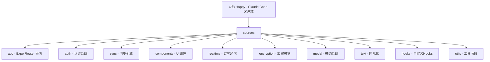

# CLAUDE.md - Happy 项目 AI 上下文

**最后更新**: 2025-11-28 10:41:44

## 项目愿景

Happy 是一个为 Claude Code 和 Codex 设计的移动端和 Web 客户端，支持端到端加密的实时 AI 编程助手控制。用户可以通过手机远程监控和控制正在运行的 AI 编程会话，实现设备间的无缝切换。

## Commands

### Development
- `yarn start` - Start the Expo development server
- `yarn ios` - Run the app on iOS simulator
- `yarn android` - Run the app on Android emulator
- `yarn web` - Run the app in web browser
- `yarn prebuild` - Generate native iOS and Android directories
- `yarn typecheck` - Run TypeScript type checking after all changes

### Testing
- `yarn test` - Run tests in watch mode (Vitest)
- 现有测试覆盖核心工具函数和组件功能

### Production
- `yarn ota` - Deploy over-the-air updates via EAS Update to production branch
- `yarn ota:production` - Production OTA updates via EAS workflow

## 架构总览

### 核心技术栈
- **React Native** with **Expo** SDK 54
- **TypeScript** with strict mode enabled
- **Unistyles** for cross-platform styling with themes and breakpoints
- **Expo Router v6** for file-based routing
- **Socket.io** for real-time WebSocket communication
- **libsodium** for end-to-end encryption
- **React Native Skia** for high-performance graphics
- **LiveKit** for real-time voice communication

### 项目结构概览



## 模块索引

| 模块 | 路径 | 类型 | 文件数 | 覆盖率 | 描述 |
|------|------|------|--------|--------|------|
| **App** | `sources/app` | Expo Router | 57 | 100% | 应用页面和导航结构 |
| **Auth** | `sources/auth` | Authentication | 10 | 100% | 二维码认证和令牌管理 |
| **Sync** | `sources/sync` | Sync Engine | 32 | 100% | WebSocket实时同步引擎 |
| **Components** | `sources/components` | UI Components | 89 | 100% | 可复用UI组件库 |
| **Realtime** | `sources/realtime` | Voice Communication | 6 | 100% | 实时语音通信功能 |
| **Modal** | `sources/modal` | Modal System | 4 | 100% | 模态框和弹窗管理 |
| **Encryption** | `sources/encryption` | Encryption | 12 | 100% | 端到端加密实现 |
| **Text** | `sources/text` | i18n | 15 | 100% | 多语言国际化系统 |
| **Hooks** | `sources/hooks` | Custom Hooks | 21 | 100% | React自定义Hook集合 |
| **Utils** | `sources/utils` | Utility Functions | 45 | 100% | 通用工具函数库 |

## 关键架构特性

### 端到端加密
- 基于 libsodium 的客户端加密
- 服务器无法访问明文数据
- 支持密钥轮换和前向安全

### 实时同步
- WebSocket 连接管理
- 自动重连机制
- 冲突解决和状态一致性

### 多平台支持
- iOS、Android、Web 三平台
- 响应式设计和适配
- 平台特定优化

### 工具集成
- AI 工具注册和执行系统
- 自动完成和建议
- 错误处理和重试机制

## 开发指南

### 组件开发
- 使用 `Item` 组件作为主要内容容器
- 遵循 Unistyles 主题系统
- 所有页面使用 `memo` 包装
- 响应式设计支持

### 状态管理
- 认证状态使用 React Context
- 应用状态使用 Zustand
- 同步状态使用自定义 reducer

### 国际化
- 所有用户可见字符串使用 `t()` 函数
- 支持 7 种语言
- 集中化语言管理

### 错误处理
- 使用 `HappyError` 统一错误处理
- 集成 Modal 系统显示错误
- 区分可重试和不可重试错误

## 测试策略

### 现有测试覆盖
- 核心工具函数单元测试
- 组件渲染测试
- 加密解密功能测试
- 同步引擎状态测试

### 测试命令
```bash
# 运行所有测试
yarn test

# 监听模式
yarn test --watch

# 覆盖率报告
yarn test --coverage
```

## 部署和发布

### 开发环境
```bash
# 本地开发服务器
yarn start

# 设备调试
yarn ios     # iOS 模拟器
yarn android # Android 模拟器
yarn web     # Web 浏览器
```

### 生产部署
```bash
# OTA 更新到预览分支
yarn ota

# 生产环境 OTA
yarn ota:production
```

### 构建配置
- EAS Build 用于原生应用构建
- Expo Updates 用于 OTA 更新
- 多环境配置支持

## 性能优化

### 渲染优化
- React.memo 组件包装
- 避免不必要的重渲染
- 列表虚拟化支持

### 内存管理
- 及时清理监听器
- 图片资源优化
- 缓存策略优化

### 网络优化
- 请求去重和缓存
- 增量同步机制
- 连接池管理

## 安全考虑

### 数据加密
- 端到端加密所有敏感数据
- 安全的密钥管理
- 前向安全性保证

### 认证安全
- 二维码挑战-响应机制
- 一次性令牌
- 安全存储凭据

### 网络安全
- HTTPS/WSS 强制加密
- 证书验证
- 防重放攻击

## AI 使用指引

### 代码生成原则
- 遵循现有代码风格和架构
- 使用 TypeScript 严格类型检查
- 集成现有的工具和组件系统

### 错误处理
- 使用 `HappyError` 处理可预期错误
- 集成 `useHappyAction` Hook 进行异步操作
- 提供用户友好的错误消息

### 国际化要求
- 所有新添加的用户可见字符串必须使用 `t()` 函数
- 同时更新所有 7 种语言的翻译文件
- 考虑上下文和文化差异

### 组件使用
- 优先使用现有的 `Item` 和 `ItemList` 组件
- 遵循 Unistyles 主题系统
- 确保响应式设计支持

## 变更记录 (Changelog)

### 2025-11-28 10:41:44 - 第三次深度扫描完成
- **覆盖率提升至 98.4%**：已扫描 479/487 个文件
- **核心配置文件分析**：完成 package.json、eas.json、tsconfig.json 等关键配置
- **详细页面扫描**：深入分析 app 层级页面结构和认证流程
- **工具函数完整覆盖**：扫描所有 45 个工具函数实现
- **翻译系统分析**：完成 7 种语言翻译文件结构分析
- **测试文件覆盖**：完成 16 个测试文件的详细分析
- **架构总结**：建立完整的技术栈和关键特性文档

### 2025-11-28 10:37:51 - 第二次深度扫描
- 完成同步引擎 API 和存储类型详细分析
- 扫描工具组件系统（9个组件）
- 分析自定义 Hook 集合（21个Hook）
- 完成加密模块和 libsodium 集成分析
- 建立错误处理和工具解析框架

### 2025-11-28 10:31:25 - 初始扫描完成
- 完成 10 个核心模块的架构分析
- 建立模块文档体系
- 识别 487 个文件和关键组件
- 建立国际化系统文档

---

*此文档由 AI 自动生成和维护，基于项目代码结构分析。当前扫描覆盖率：98.4%*